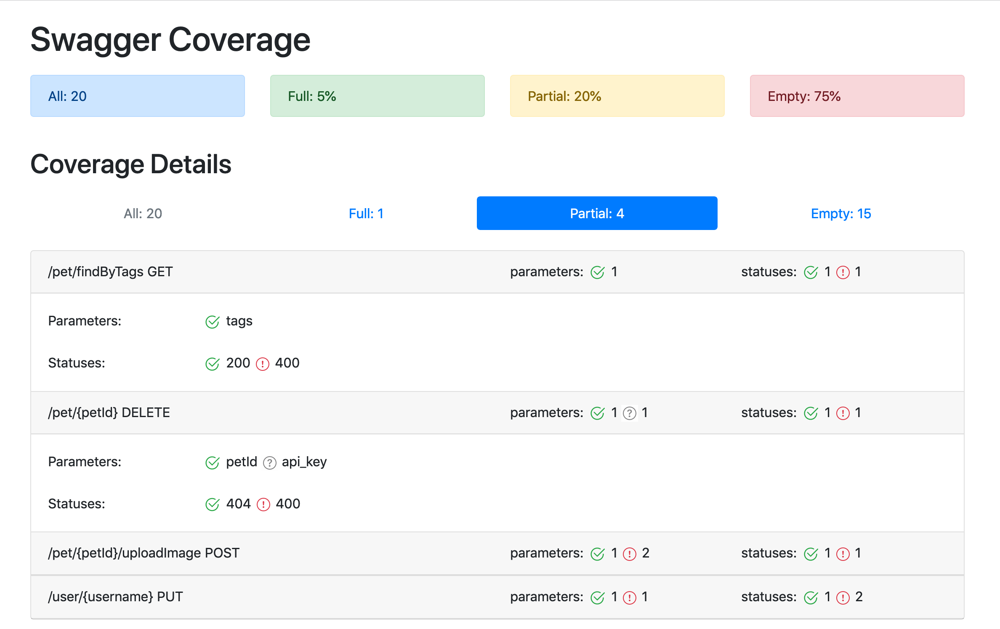

[license]: http://www.apache.org/licenses/LICENSE-2.0 "Apache License 2.0"
[release]: https://github.com/viclovsky/swagger-coverage/releases/latest "Latest release"
[release-badge]: https://img.shields.io/github/release/viclovsky/swagger-coverage.svg?style=flat
[](https://github.com/viclovsky/swagger-coverage/actions)
[![release-badge][]][release]

# swagger-coverage
Swagger-coverage gives a full picture about coverage of API tests (regression) based on OAS 2 (Swagger). 
By saying coverage we mean not a broad theme functionality, but presence (or absence) of calls defined by API methods, parameters, return codes or other conditions which corresponds specification of API.



## How it works
Producing coverage report consists of two parts. Firstly, during test execution, filter/interceptor/proxy save information of calls in swagger format in specific folder on executing tests.
The next stage is to compare saved result with generated conditions from current API specification and builds report.  

## How to use and examples
You can use swagger-coverage with any language and framework. You need to have proxy/filter/interceptor that accumulates data in swagger format. 
Swagger-coverage have rest-assured integration from the box.

* Add dependencies and filter to your test client
Add repository to pom.xml
```xml
 <repositories>
        <repository>
            <id>viclovsky</id>
            <url>https://dl.bintray.com/viclovsky/maven/</url>
        </repository>
 </repositories>
```

Add filter dependency:
```xml
 <dependency>
     <groupId>com.github.viclovsky.swagger.coverage</groupId>
     <artifactId>swagger-coverage-rest-assured</artifactId>
     <version>${latest-swagger-coverage-version}</version>
 </dependency>
```
or if use gradle, it can be added like
```
repositories {
    maven { url 'https://dl.bintray.com/viclovsky/maven' }
}
```

```
compile "com.github.viclovsky.swagger.coverage:swagger-coverage-rest-assured:$latest-swagger-coverage-version"
```

Just add filter into test client SwaggerCoverageRestAssured. For instance, as presented below:
```java
RestAssured.given().filter(new SwaggerCoverageRestAssured())
```

* Download and run command line.
Download zip archive and unpack it. Don't forget to replace {latest-swagger-coverage-version} to latest version. 
```
wget https://dl.bintray.com/viclovsky/maven/com/github/viclovsky/swagger/coverage/swagger-coverage-commandline/{latest-swagger-coverage-version}/swagger-coverage-commandline-{latest-swagger-coverage-version}.zip
unzip swagger-coverage-commandline-{latest-swagger-coverage-version}.zip
```

Here is help of unzip swagger-commandline

```
./swagger-coverage-commandline --help

  Options:
  * -s, --spec
      Path to swagger specification.
  * -i, --input
      Path to folder with generated files with coverage.
    -c, --configuration
      Path to file with report configuration.
    --help
      Print commandline help.
    -q, --quiet
      Switch on the quiet mode.
      Default: false
    -v, --verbose
      Switch on the verbose mode.
      Default: false
```

To compare result of API tests with current API specification and build report call command line tool after running tests like that:

```
./swagger-coverage-commandline -s swagger.json -i swagger-coverage-output
```

Output of the command:
```
19:21:21 INFO  OperationSwaggerCoverageCalculator - Empty coverage:
...
19:21:21 INFO  OperationSwaggerCoverageCalculator - Partial coverage:
...
19:21:21 INFO  OperationSwaggerCoverageCalculator - Full coverage:
...
19:21:21 INFO  OperationSwaggerCoverageCalculator - Conditions: 874/2520
19:21:21 INFO  OperationSwaggerCoverageCalculator - Empty coverage 49.284 %
19:21:21 INFO  OperationSwaggerCoverageCalculator - Partial coverage 12.034 %
19:21:21 INFO  OperationSwaggerCoverageCalculator - Full coverage 38.682 %
19:21:21 INFO  FileSystemResultsWriter - Write html report in file '.../swagger-coverage-report.html'
```
Results (swagger-coverage-report.html/swagger-coverage-results.json) will be created after running of swagger-coverage.

## Configuration options
Swagger-coverage report can be configured by json-file. 
You can control list of coverage, which be generated and checked for results.

## Rules configuration options
Options for different rules are placed in "rules" section. 
You can disable some rules or change their behavior.

#### Checking response http-status
This rule create condition for every status from *responses*-section of swagger specification.
Condition mark *covered* when report generator find specific status in results files.
Options for this rules are placed in *status* subsection in *rules* sections.

You can setup next options:

**enable** - *true/false*. You can disable this rule. Default value is *true*.

**filter** - *[val1,val2]*. Rule will ignore all status, which not in filter list.

**ignore** - *[val1,val2]*. Rule will ignore all status, which in ignore list.

```` 
{
  "rules" : {
    "status": {
      "enable": true,
      "ignore": ["400","500"],
      "filter": ["200"]
    },

    ....
  },
  
  ....
}
````

#### Checking the list of declared and received statuses
This rule create condition for comparing declared and received status. 
Condition marked as *covered* when result not contains any of undeclared status.
*Uncovered* state of this condition indicates missed status in original swagger-documentation 
or server errors.
Options for this rules are placed in *only-declareted-status* subsection in *rules* sections.


You can setup next options:

**enable** - *true/false*. You can disable this rule. Default value is *true*.

````
{
  "rules" : {

    ....

    "only-declareted-status" : {
      "enable" : true
    }
  },

   ....
}
````

#### Excluding deprecated operations from the coverage report statistic
This rule is created for cases when you don't want to measure coverage of deprecated operations, but only for actual ones. <br>
If an operation is deprecated then it will be excluded from *Full*, *Partial*, and *Empty* categories and won't affect the "Operations coverage summary"

Options for this rule are placed in "*exclude-deprecated*" subsection in *rules* sections.

You can set up next options:

**enable** - *true/false*. <br>
By default, this rule is not enabled. Add it to the config file with *true* value to enable this rule, like in the example below:

````
{
  "rules" : {

    ....

    "exclude-deprecated" : {
      "enable" : true
    }
  },

   ....
}
````

If you need you can add your rules for generation of conditions. So, please, send your PRs.

## Result writer configuration
Options for report generation setting are placed in *writers* sections.

#### HTML report writer
Options for html-report placed in subsection *html* of *writers* sections.

You can setup next options:

**locale** - two latter language code. Now supported only *en/ru*.

**filename** - filename for html report.

````
{
  ....

  "writers": {
      "html": {
        "locale": "ru",
        "filename":"report.html"
      }
  }
}
````

#### Report customization
To customize your http report with your own template set full path to the template like below:
````
{
  ....
  
  "writers": {
    "hml": {
      ....
      "customTemplatePath": "/full/path/to/report_custom.ftl"
    }
  }
}
````

## Demo
I have prepared several tests. Thus you are able to have a look and touch swagger-coverage. Just run ```run.sh``` script.

## Important remark
Swagger-coverage works fine with clients which were generated from swagger (for example: https://github.com/OpenAPITools/openapi-generator). 
Because all methods/parameters which will be saved are 100% compatible with current API specification. 

## Requirements 
For a moment swagger-coverage  is compatible only with OpenApi specification v2. It is possible that swagger-coverage will support other versions.

## Pull Requests
My project is open for any enhancement. So, your help is much appreciated. Please, feel free to open your pull request or issue and I will consider it in several days.

## Created & Maintained By
[Victor Orlovsky](https://github.com/viclovsky)

## Contributing to swagger-coverage
Thanks to all people who contributed. Especially [@TemaMak](https://github.com/TemaMak) who have contributed significant improvements to swagger-coverage.

## License
Swagger coverage is released under version 2.0 of the [Apache License](http://www.apache.org/licenses/LICENSE-2.0)
